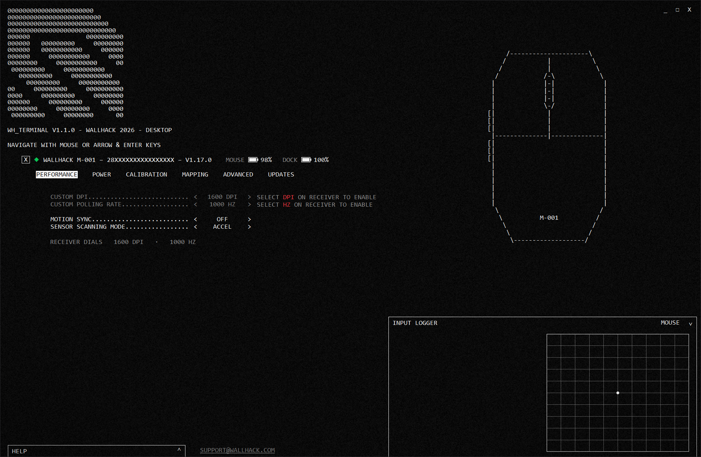
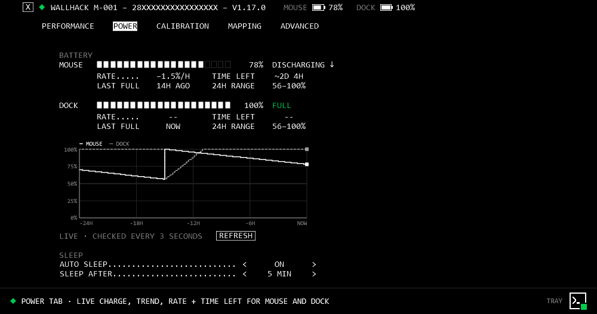
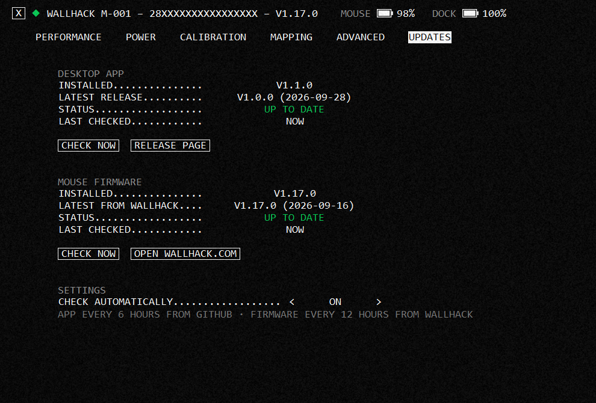
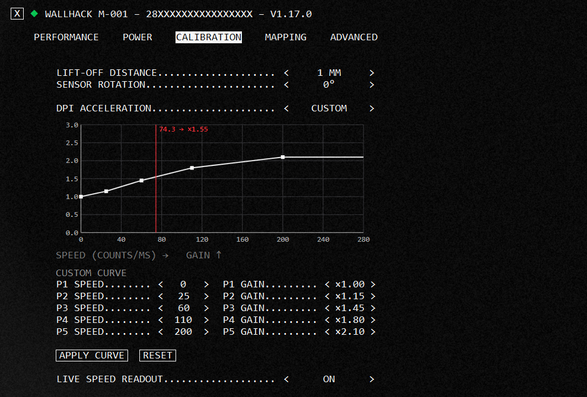
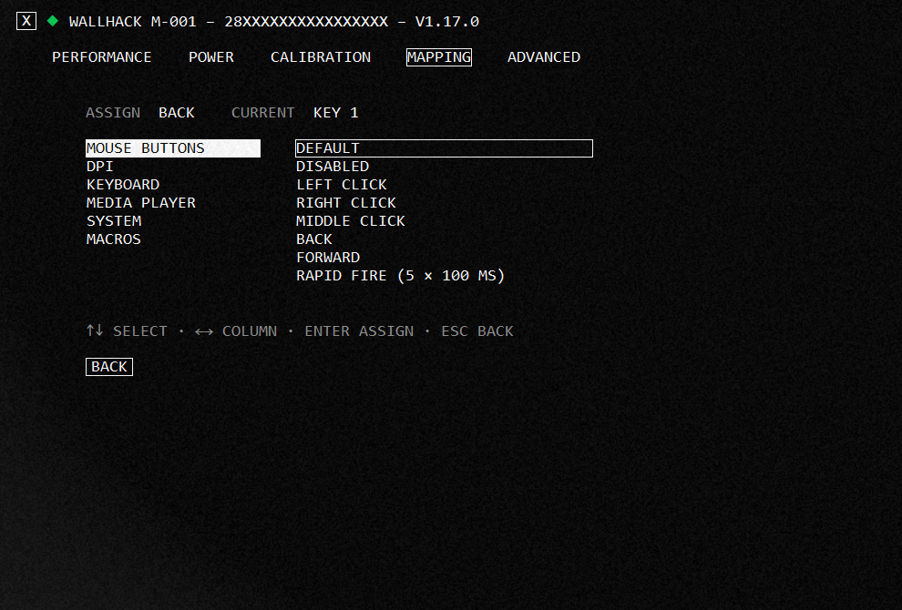
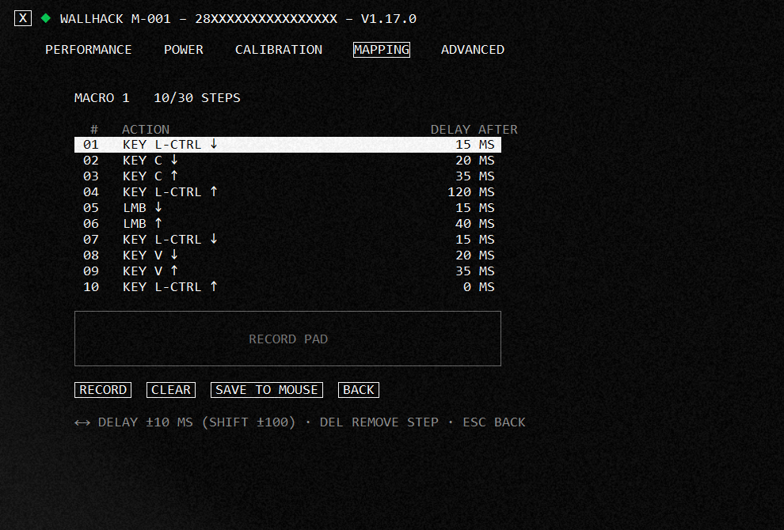
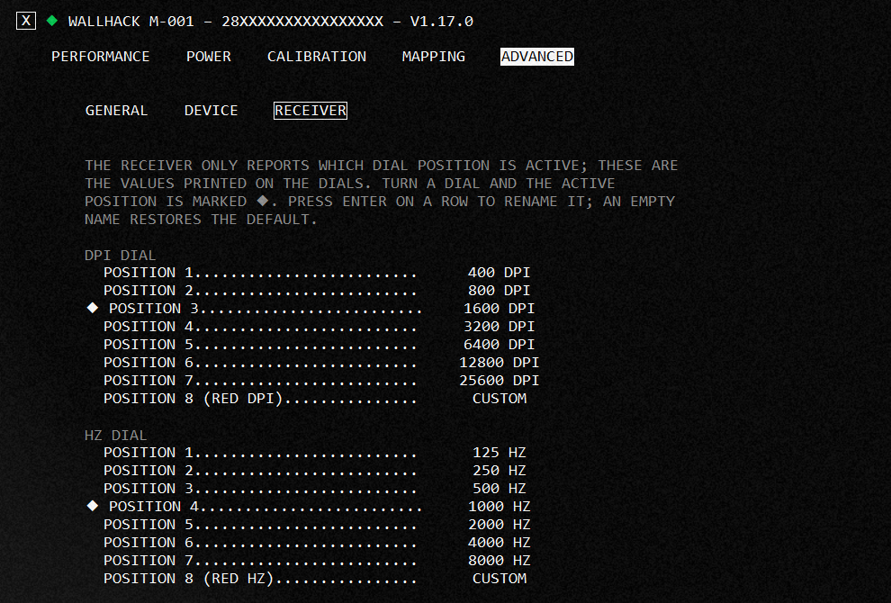
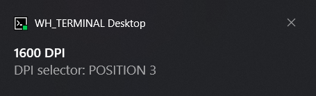
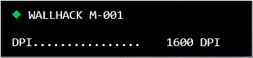

```text
000   000           00000    00000     000
0000 0000          00   00  00   00   0000
00 000 00  000000  00   00  00   00     00
00  0  00          00   00  00   00     00
00     00           00000    00000    000000

WH_TERMINAL DESKTOP V1.1.0 - WALLHACK M-001

◆ NATIVE WINDOWS CONFIGURATOR + TRAY NOTIFICATIONS
```



```text
PERFORMANCE ....................... DPI · POLLING RATE · MOTION SYNC · SCANNING MODE
POWER ............................. MOUSE + DOCK BATTERY · 24H GRAPH · AUTO SLEEP
CALIBRATION ....................... LIFT-OFF · SENSOR ROTATION · DPI ACCELERATION
MAPPING ........................... BUTTONS · KEYS · MEDIA · ON-BOARD MACROS
UPDATES ........................... APP SELF-UPDATE · FIRMWARE CHECK
TRAY .............................. DIAL CHANGES · BATTERY SWAP · LOW BATTERY ALERTS
```

## > SCREENSHOTS

| `POWER` | `UPDATES` |
| :---: | :---: |
|  |  |
| `CALIBRATION` | `MAPPING` |
|  |  |
| `MACROS` | `RECEIVER DIALS` |
|  |  |

| `WINDOWS NOTIFICATION` | `ON-SCREEN OVERLAY` |
| :---: | :---: |
|  |  |

```text
TURN A DIAL ON THE RECEIVER ....... THE TRAY ANNOUNCES THE NEW DPI / HZ
SWAP THE DOCK BATTERY ............. THE TRAY ANNOUNCES IT
NEW RELEASE ON GITHUB ............. UPDATES TAB → INSTALL UPDATE
NEW MOUSE FIRMWARE ................ UPDATES TAB → WALLHACK.COM
```

## > DOWNLOAD

Grab `WallhackTerminal.exe` from [Releases](https://github.com/esmith443/Wallhack-M001-Desktop-Terminal/releases). Requires the
[.NET 10 Desktop Runtime](https://dotnet.microsoft.com/download/dotnet/10.0). After that the app updates itself: each download is
checked against the release's SHA-256 before it replaces the old version. Mouse firmware is only ever installed through Wallhack's
official web terminal.

## > BUILD IT YOURSELF

```text
REQUIREMENTS ...................... WINDOWS 10 / 11 · .NET 10 SDK
```

```bash
git clone https://github.com/esmith443/Wallhack-M001-Desktop-Terminal.git
cd Wallhack-M001-Desktop-Terminal
dotnet publish -c Release -r win-x64 --self-contained false -p:PublishSingleFile=true -o publish
```

```text
OUTPUT ............................ publish\WallhackTerminal.exe
```

Optional: put a font in `Assets\Fonts\` and a `noise.png` in `Assets\` before building to change the look.

```text
UNOFFICIAL PROJECT · NOT AFFILIATED WITH WALLHACK
```
